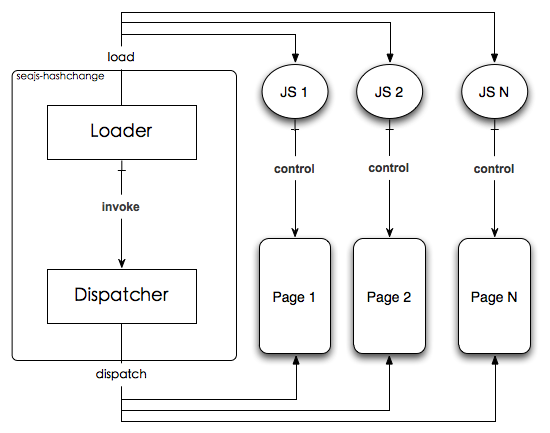
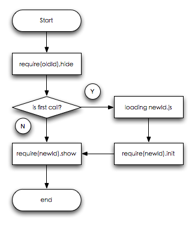
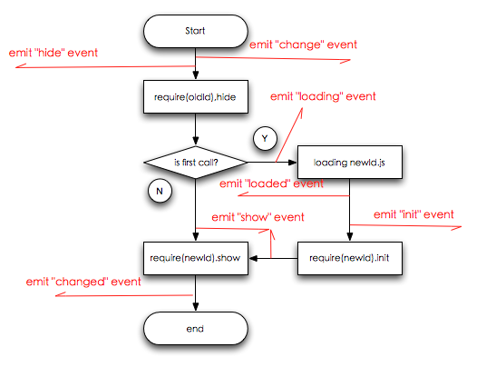

# seajs-hashchange
    A Sea.js application for one page mode base on hashchange.

## Schematic



## Flow Chart



This picture is show how seajs-hashchange work.

## Events Chart



This picture is show the time that events emit.

## Usage

```js
seajs.use('path/to/seajs-hashchange.js', function(HashChange) {
    // default: / is equivalent to /#id=index or /?id=index
    var hashChange = HashChange({
        // id: 'id',
        // defaultValue: 'index',
        // hashKey: '#',
        // for load more ids or not ids
        getId: function(id) {
            switch(id) {
                case 'plainPage':
                case 'noJsPage':
                    return;
                case 'moreJs':
                    return ['moreJs', 'otherJS'];
                default:
                    return [id];
            }
        }
    }).on('show', function(my) {
        // run before exec show function of show module.
        document.getElementById(my.id).style.display = 'block';
    }).on('hide', function(my, next) {
        // run before exec hide function of the hide module.
        document.getElementById(my.id).style.display = 'none';
    }).on('loading', function(my) {
        // only exec when load from server
        console.log(seajs.resolve(my.id) + ' is loading');
    }).on('loaded', function(my) {
        // only exec when loaded from server
        console.log(seajs.resolve(my.id) + ' is loaded');
    }).on('change', function(my) {
        // run before every hash change
        console.log('going to change...');
    }).on('changed', function(my, old) {
        // run after every hash change
        console.log(my.id +' page is show! ' + old.id + ' page is hided!');
    });
    
    /* load templets synchron */
    var CHANGE = 'change';
    function loadTpl(ids, url) {
        var fn = function(my) {
            if (!ids || ~$.inArray(my.id, ids)) {
                if (!$('#' + my.id)[0]) {
                    $.ajax({
                        url: url, // '/frame/mycenter.tpl',
                        async: false, // synchron
                        success: function(data) {
                            $("#bd").append(data);
                        },
                        error: function() {
                            alert('数据加载失败，请刷新页面重试~');
                            location.reload();
                        }
                    });
                    hashChange.off(CHANGE, fn);
                }
            }
        }
        hashChange.on(CHANGE, fn);
    }
    function loadStyle(ids, url) {
        var fn = function(my) {
            if (!ids || ~$.inArray(my.id, ids)) {
                if (!$('#' + my.id)[0]) {
                    var link = '<link rel="stylesheet" href="' + url + '"/>';
                    $('head').append(link);
                    hashChange.off(CHANGE, fn);
                }
            }
        };
        hashChange.on(CHANGE, fn);

    }
    // loadTpl(['someId', 'otherId'], 'TPL_URL');
    // loadStyle(['someId', 'otherId'], 'STYLE_LINK');

    // init
    hashChange.change();
});
```

## implement

some method will after every hashchange.
some api should be implement from running js. There are: init, show, hide.

### init(newParams, oldParams)

### show(newParams, oldParams)

### hide(oldParams, newParams)

## Finally

Anyway, see examples in the `examples/` directory.
